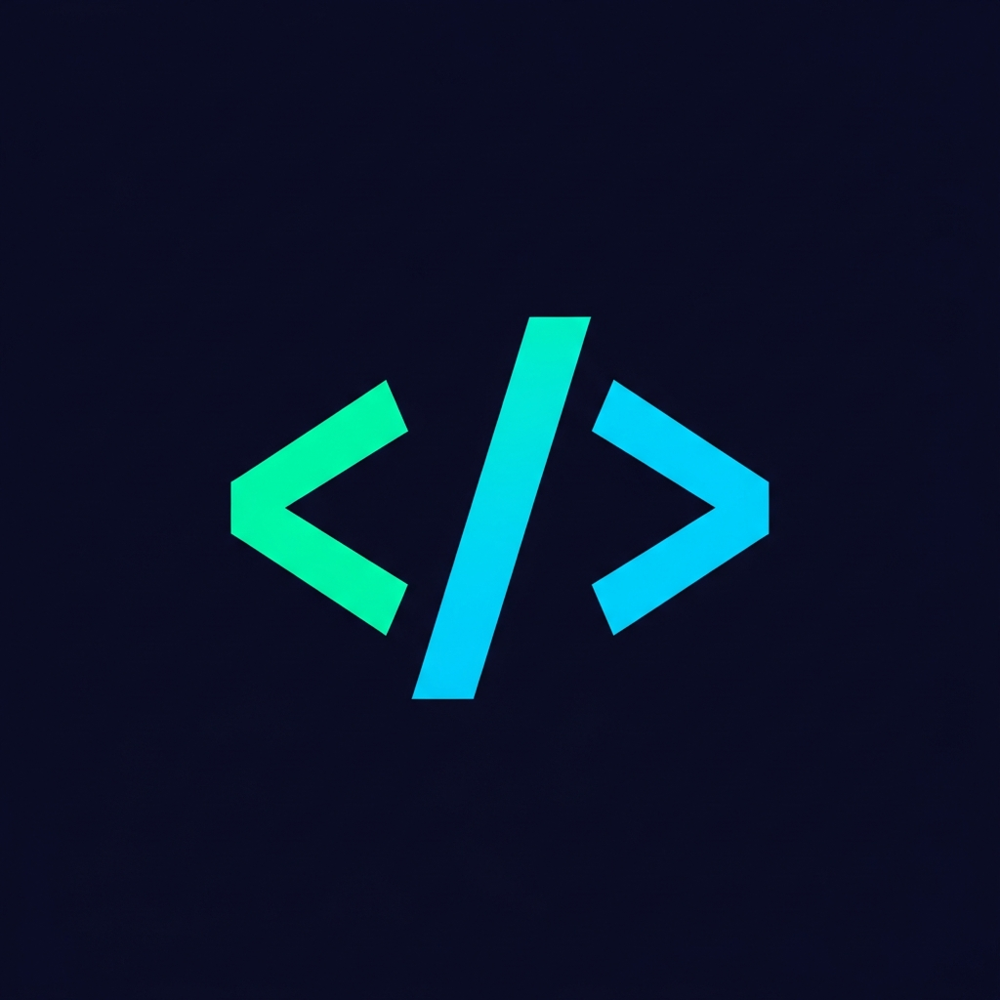

# CodeDrills



> Replace mindless scrolling with something actually useful — practice and learn coding, one drill at a time.

CodeDrills is a mobile app that delivers bite-sized coding challenges and lessons so you can turn idle moments into real learning. Pick a language, pick a level, and drill.

---

## 📚 Content Structure

Community-contributed content lives under two top-level directories:

```
challenges/
  <language>/
    <language>_challenges.json
topics/
  <language>/
    <language>_topics.json
```

### Supported Languages

| Language   | Directory         |
|------------|-------------------|
| Python     | `python/`         |
| SQL        | `sql/`            |
| JavaScript | `javascript/`     |
| Rust       | `rust/`           |

### Levels

Each file covers four levels:

| Level        | Description                              |
|--------------|------------------------------------------|
| `new`        | No prior experience assumed              |
| `beginner`   | Basic syntax and concepts                |
| `intermediate` | Real-world patterns and problem-solving |
| `advanced`   | Performance, idioms, deeper internals    |

---

## 🗂️ JSON Schemas

See the [`examples/`](examples/) folder for annotated reference files:

- [`examples/challenge_example.json`](examples/challenge_example.json) — challenge format
- [`examples/lesson_example.json`](examples/lesson_example.json) — topic/lesson format

### Challenge keys

```json
{
  "language": "python",
  "levels": [
    {
      "level": "new",
      "challenges": [
        {
          "id": "py-new-1",
          "language": "python",
          "level": "new",
          "title": "...",
          "description": "...",
          "starterCode": "...",
          "hint": "...",
          "solution": {
            "code": "...",
            "steps": [
              { "title": "...", "explanation": "..." }
            ]
          }
        }
      ]
    }
  ]
}
```

### Topic keys

```json
{
  "language": "python",
  "levels": [
    {
      "level": "new",
      "topics": [
        {
          "id": "py-new-datatypes",
          "language": "python",
          "level": "new",
          "title": "...",
          "description": "...",
          "estimatedMinutes": 8,
          "lessons": [
            { "title": "...", "body": "...", "code": "..." }
          ]
        }
      ]
    }
  ]
}
```

---

## 🛠️ Scripts

### `scripts/merge_content.py` — Build combined output files

This script reads all language-specific challenge and topic JSON files,
deduplicates entries by `id`, and writes two merged files into an `output/`
directory at the repository root (excluded from version control via `.gitignore`).

**Deduplication rule:** if an output file from a previous run already exists,
its entries are loaded first and take priority.  New entries whose `id` already
appears in the existing output are skipped, so manual edits to the output files
are preserved across re-runs.

#### Usage

```bash
# Merge both challenges and lessons (default)
python scripts/merge_content.py

# Merge challenge files only
python scripts/merge_content.py --challenges

# Merge lesson/topic files only
python scripts/merge_content.py --lessons
```

#### Output files

| File | Contents |
|------|----------|
| `output/challenges.json` | All challenges from every language, flat list keyed by `challenges` |
| `output/lessons.json` | All topics (with nested lessons) from every language, flat list keyed by `topics` |

---

## 🤝 Contributing

We welcome challenge and topic contributions! Read [CONTRIBUTING.md](CONTRIBUTING.md) for step-by-step instructions, naming conventions, and the review process.

---

## 🔒 Privacy

See [privacy-policy.md](privacy-policy.md).

---

## 📄 License

[MIT](LICENSE) © Federico Raimondi
